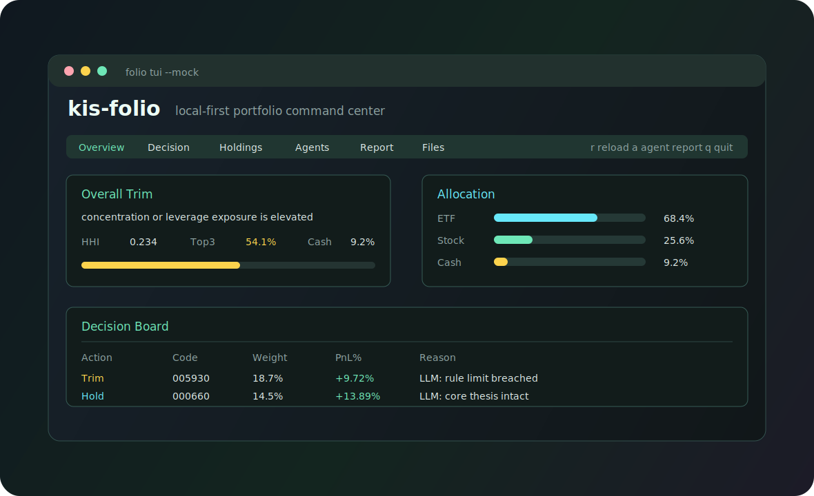
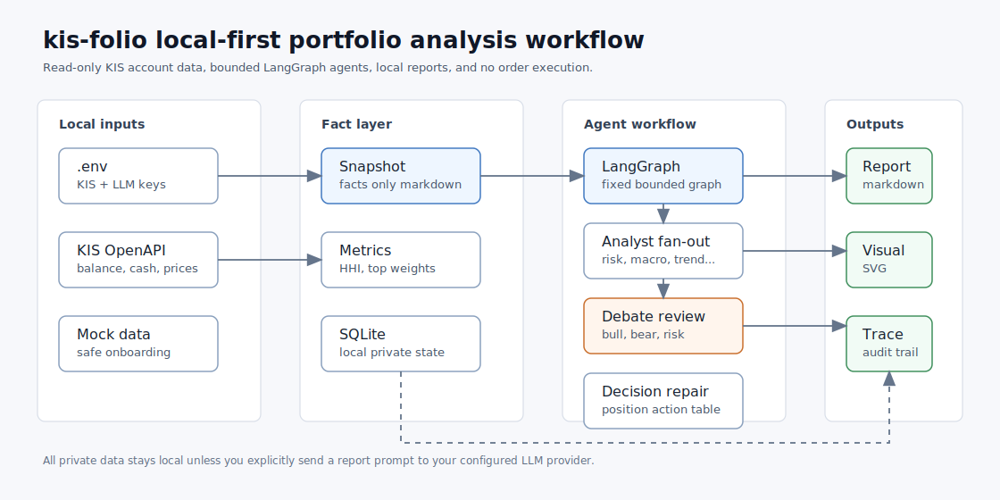

# kis-folio

> KIS OpenAPI 계좌를 읽어 포트폴리오 스냅샷, 리스크 지표, 매수/보유/축소 후보, LangGraph 멀티 에이전트 리포트를 로컬에서 생성하는 TUI 중심 투자 분석 도구입니다.

[](https://www.python.org/)
[](https://langchain-ai.github.io/langgraph/)
[](#안전-원칙)
[](LICENSE)

`kis-folio`는 자동매매 봇이 아닙니다. 계좌를 읽고, 사실 기반 스냅샷을 만들고, 포트폴리오 의사결정에 필요한 근거를 보기 좋게 정리합니다. 주문 전송 기능은 의도적으로 없습니다.



## 왜 쓰나요?

- **터미널에서 바로 보는 계좌 현황**: 평가금, 현금, 손익, HHI, 상위 3종목 비중, 레버리지 노출을 한 화면에서 확인합니다.
- **Action-oriented report**: 최종 리포트가 `Increase / Hold / Trim / Exit / Watch` 관점으로 종목별 조치와 근거를 정리합니다.
- **TradingAgents-inspired workflow**: 7개 분석 렌즈, bull/bear/risk debate, Portfolio Manager synthesis를 LangGraph로 실행합니다.
- **Local-first**: SQLite, 리포트, 토큰 캐시는 로컬에 저장됩니다. `.env`, `reports/`, DB 파일은 Git 추적에서 제외됩니다.
- **초보자 안전 체험**: KIS 키와 LLM 키 없이 `--mock` 데이터로 TUI와 리포트 생성을 먼저 확인할 수 있습니다.

## 3분 체험

실계좌나 LLM API 없이 화면과 산출물부터 확인합니다.

```bash
python3.12 -m venv .venv
source .venv/bin/activate
python -m pip install -e ".[dev]"

folio tui --mock
folio report --mock --no-llm --period 2026-05
```

생성 파일은 `reports/2026-05/` 아래에 저장됩니다.

## 실제 계좌 연결

가장 쉬운 방법은 대화형 설정입니다.

```bash
folio setup
folio doctor
```

수동 설정을 선호하면:

```bash
cp .env.example .env
```

`.env`에 아래 값을 채웁니다.

```bash
KIS_APP_KEY_MAIN=your_kis_app_key
KIS_APP_SECRET_MAIN=your_kis_app_secret
KIS_CANO_MAIN=12345678
KIS_ACNT_PRDT_CD_MAIN=01

LLM_PROVIDER=openrouter
LLM_API_KEY=sk-your-openrouter-key
LLM_BASE_URL=https://openrouter.ai/api/v1
LLM_MODEL_ADVISOR=anthropic/claude-sonnet-4.6
LLM_MODEL_ADVISOR_DEEP=anthropic/claude-opus-4.7
LLM_MODEL_FAST=anthropic/claude-haiku-4.5
```

계좌를 등록하고 연결을 확인합니다.

```bash
folio init-db
folio account add --id main --label "Main" --cano 12345678 --product-code 01
folio doctor --network
folio status
folio tui
```

## TUI 사용법

```bash
folio tui          # 실계좌 TUI
folio tui --mock   # 데모 데이터 TUI
```

키보드:

| Key | 동작 |
|---|---|
| `r` | 계좌 갱신 안내 |
| `a` | LangGraph agentic report 생성 |
| `v` | 최신 리포트 위치 안내 |
| `q` | 종료 |

탭 구성:

| 탭 | 내용 |
|---|---|
| Overview | 총자산, 현금, 손익, HHI, Top3, 레버리지, 자산 배분 |
| Decision | 종목별 `Increase / Hold / Trim / Exit / Watch` 보드와 판단 근거 |
| Holdings | 보유 종목 테이블 |
| Agents | LangGraph 실행 흐름, 토큰/비용, 에이전트 상태 |
| Report | 최신 최종 리포트 미리보기 |
| Files | 생성되는 markdown/SVG 파일 목록 |

## 리포트 생성

사실 스냅샷과 SVG만 생성:

```bash
folio report --no-llm
```

단일 LLM 리포트:

```bash
folio report
```

LangGraph 멀티 에이전트 리포트:

```bash
folio report --agentic
```

토론을 더 깊게 돌리는 실행:

```bash
folio report --agentic \
  --agent-engine langgraph \
  --debate-rounds 3 \
  --agent-retries 2
```

기본 agentic workflow는 7개 초기 분석가, 라운드당 3개 debate/review agent,
그리고 1개 Portfolio Manager synthesis로 구성됩니다. 기본 debate round는 3회입니다.

특정 날짜까지 현금이 필요한 경우:

```bash
folio report \
  --cash-need 50000000 \
  --needed-by 2026-05-28 \
  --withdraw-by 2026-05-25
```

## 산출물

`reports/<YYYY-MM>/`에 아래 파일이 생성됩니다.

| 파일 | 설명 |
|---|---|
| `portfolio_snapshot.md` | LLM 입력용 fact-only 계좌 스냅샷 |
| `portfolio_agent_briefs.md` | 결정론적 리스크/성과/배분 브리프 |
| `portfolio_multi_agent_runs.md` | agentic 실행 시 역할별 LLM 출력 |
| `portfolio_workflow_trace.md` | 엔진, 이벤트, 재시도, 토큰, 비용 추적 |
| `portfolio_visual.svg` | 포트폴리오 시각 요약 |
| `portfolio_analysis_report.md` | 최종 분석 리포트 |



## `.env` 핵심 변수

| 변수 | 필수 | 설명 |
|---|---|---|
| `FOLIO_DB_PATH` | 선택 | SQLite 경로. 기본값: `~/.folio/folio.db` |
| `FOLIO_TOKEN_CACHE_PATH` | 선택 | KIS 토큰 캐시 경로 |
| `KIS_BASE_URL` | 필수 | KIS OpenAPI base URL |
| `KIS_APP_KEY_MAIN` | 필수 | KIS app key |
| `KIS_APP_SECRET_MAIN` | 필수 | KIS app secret |
| `KIS_CANO_MAIN` | 필수 | 8자리 계좌 앞번호 |
| `KIS_ACNT_PRDT_CD_MAIN` | 필수 | 상품 코드. 보통 `01` |
| `KIS_HTS_ID` | 경우에 따라 | KIS 앱 설정에 따라 필요할 수 있음 |
| `LLM_PROVIDER` | LLM 사용 시 | 기본값 `openrouter` |
| `LLM_API_KEY` | LLM 사용 시 | OpenRouter 또는 OpenAI-compatible provider key |
| `LLM_BASE_URL` | LLM 사용 시 | `/chat/completions` compatible base URL |
| `LLM_MODEL_ADVISOR` | LLM 사용 시 | 메인 리포트 모델 |
| `LLM_MODEL_ADVISOR_DEEP` | 선택 | 고성능 심층 분석 모델 |
| `LLM_MODEL_FAST` | agentic 사용 시 | 가벼운 에이전트용 모델 |
| `LLM_MAX_OUTPUT_TOKENS` | 선택 | 에이전트별 출력 상한 |
| `LLM_MAX_REPORT_TOKENS` | 선택 | 최종 리포트 출력 상한 |

## 안전 원칙

- 주문, 매수, 매도 API를 호출하지 않습니다.
- `.env`, `reports/`, SQLite DB, 토큰 캐시는 커밋하지 않습니다.
- 리포트는 투자 조언이 아니라 의사결정 보조 자료입니다.
- LLM 결과는 틀릴 수 있으며, 최종 판단과 주문 책임은 사용자에게 있습니다.
- KIS, OpenRouter, LLM provider의 약관과 비용 정책은 사용자가 직접 확인해야 합니다.

## 개발자 워크플로우

```bash
make check
make audit
git status --short --ignored
```

커밋은 Conventional Commits를 사용합니다.

```bash
feat(tui): add decision board
fix(llm): validate provider response shape
docs(readme): improve onboarding guide
```

## 라이선스

MIT. 자세한 내용은 [LICENSE](LICENSE)를 확인하세요.
